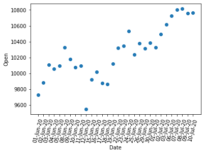
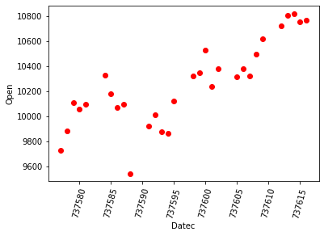
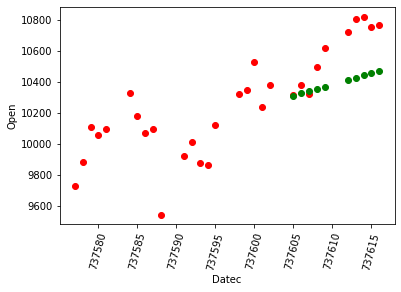
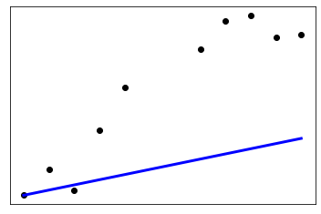
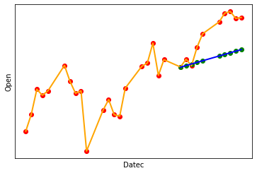

```python
import pandas as pd
import numpy as np
import matplotlib.pyplot as plt
from sklearn import linear_model
from sklearn.metrics import mean_squared_error, r2_score
import datetime as dt
```


```python
df=pd.read_csv("small.csv") #import dataset
# convert dates format from strings to integer with label name Datec
df['Datec'] = pd.to_datetime(df['Date'])
df['Datec']=df['Datec'].map(dt.datetime.toordinal)
```


```python
print(df.shape)
df
```

    (30, 3)
    


<div>
    
<table border="1" class="dataframe">
  <thead>
    <tr style="text-align: right;">
      <th></th>
      <th>Date</th>
      <th>Open</th>
      <th>Datec</th>
    </tr>
  </thead>
  <tbody>
    <tr>
      <th>0</th>
      <td>01-Jun-20</td>
      <td>9726.85</td>
      <td>737577</td>
    </tr>
    <tr>
      <th>1</th>
      <td>02-Jun-20</td>
      <td>9880.85</td>
      <td>737578</td>
    </tr>
    <tr>
      <th>2</th>
      <td>03-Jun-20</td>
      <td>10108.30</td>
      <td>737579</td>
    </tr>
    <tr>
      <th>3</th>
      <td>04-Jun-20</td>
      <td>10054.25</td>
      <td>737580</td>
    </tr>
    <tr>
      <th>4</th>
      <td>05-Jun-20</td>
      <td>10093.80</td>
      <td>737581</td>
    </tr>
    <tr>
      <th>5</th>
      <td>08-Jun-20</td>
      <td>10326.75</td>
      <td>737584</td>
    </tr>
    <tr>
      <th>6</th>
      <td>09-Jun-20</td>
      <td>10181.15</td>
      <td>737585</td>
    </tr>
    <tr>
      <th>7</th>
      <td>10-Jun-20</td>
      <td>10072.60</td>
      <td>737586</td>
    </tr>
    <tr>
      <th>8</th>
      <td>11-Jun-20</td>
      <td>10094.10</td>
      <td>737587</td>
    </tr>
    <tr>
      <th>9</th>
      <td>12-Jun-20</td>
      <td>9544.95</td>
      <td>737588</td>
    </tr>
    <tr>
      <th>10</th>
      <td>15-Jun-20</td>
      <td>9919.35</td>
      <td>737591</td>
    </tr>
    <tr>
      <th>11</th>
      <td>16-Jun-20</td>
      <td>10014.80</td>
      <td>737592</td>
    </tr>
    <tr>
      <th>12</th>
      <td>17-Jun-20</td>
      <td>9876.70</td>
      <td>737593</td>
    </tr>
    <tr>
      <th>13</th>
      <td>18-Jun-20</td>
      <td>9863.25</td>
      <td>737594</td>
    </tr>
    <tr>
      <th>14</th>
      <td>19-Jun-20</td>
      <td>10119.00</td>
      <td>737595</td>
    </tr>
    <tr>
      <th>15</th>
      <td>22-Jun-20</td>
      <td>10318.75</td>
      <td>737598</td>
    </tr>
    <tr>
      <th>16</th>
      <td>23-Jun-20</td>
      <td>10347.95</td>
      <td>737599</td>
    </tr>
    <tr>
      <th>17</th>
      <td>24-Jun-20</td>
      <td>10529.25</td>
      <td>737600</td>
    </tr>
    <tr>
      <th>18</th>
      <td>25-Jun-20</td>
      <td>10235.55</td>
      <td>737601</td>
    </tr>
    <tr>
      <th>19</th>
      <td>26-Jun-20</td>
      <td>10378.90</td>
      <td>737602</td>
    </tr>
    <tr>
      <th>20</th>
      <td>29-Jun-20</td>
      <td>10311.95</td>
      <td>737605</td>
    </tr>
    <tr>
      <th>21</th>
      <td>30-Jun-20</td>
      <td>10382.60</td>
      <td>737606</td>
    </tr>
    <tr>
      <th>22</th>
      <td>01-Jul-20</td>
      <td>10323.80</td>
      <td>737607</td>
    </tr>
    <tr>
      <th>23</th>
      <td>02-Jul-20</td>
      <td>10493.05</td>
      <td>737608</td>
    </tr>
    <tr>
      <th>24</th>
      <td>03-Jul-20</td>
      <td>10614.95</td>
      <td>737609</td>
    </tr>
    <tr>
      <th>25</th>
      <td>06-Jul-20</td>
      <td>10723.85</td>
      <td>737612</td>
    </tr>
    <tr>
      <th>26</th>
      <td>07-Jul-20</td>
      <td>10802.85</td>
      <td>737613</td>
    </tr>
    <tr>
      <th>27</th>
      <td>08-Jul-20</td>
      <td>10818.65</td>
      <td>737614</td>
    </tr>
    <tr>
      <th>28</th>
      <td>09-Jul-20</td>
      <td>10755.55</td>
      <td>737615</td>
    </tr>
    <tr>
      <th>29</th>
      <td>10-Jul-20</td>
      <td>10764.10</td>
      <td>737616</td>
    </tr>
  </tbody>
</table>
</div>


```python
#Graph or 30 days closing price of our data
plt.xticks(rotation=75)
plt.xlabel("Date")
plt.ylabel("Open")
plt.scatter(df['Date'],df['Open'])
```


    <matplotlib.collections.PathCollection at 0x8dbbcf0>


    

    


```python
# Graph of Open Price and Date but here date in integer format
plt.xticks(rotation=75)
plt.xlabel("Datec")
plt.ylabel("Open")
plt.scatter(df['Datec'],df['Open'],color='red')
```


    <matplotlib.collections.PathCollection at 0x8ebaf30>


    

    


```python
# Use first 20 data set for training
x_train=np.array(df['Datec'][:20])
X_train=x_train.reshape(-1,1)
X_train
```


    array([[737577],
           [737578],
           [737579],
           [737580],
           [737581],
           [737584],
           [737585],
           [737586],
           [737587],
           [737588],
           [737591],
           [737592],
           [737593],
           [737594],
           [737595],
           [737598],
           [737599],
           [737600],
           [737601],
           [737602]], dtype=int64)


```python
y_train=np.array(df['Open'][:20])
Y_train=y_train.reshape(-1,1)
Y_train
```


    array([[ 9726.85],
           [ 9880.85],
           [10108.3 ],
           [10054.25],
           [10093.8 ],
           [10326.75],
           [10181.15],
           [10072.6 ],
           [10094.1 ],
           [ 9544.95],
           [ 9919.35],
           [10014.8 ],
           [ 9876.7 ],
           [ 9863.25],
           [10119.  ],
           [10318.75],
           [10347.95],
           [10529.25],
           [10235.55],
           [10378.9 ]])


```python
regr = linear_model.LinearRegression()
```


```python
z=regr.fit(X_train,Y_train)
```


```python
x_test=np.array(df['Datec'][-10:])
X_test=x_test.reshape(-1,1)
print(X_test)

print(22*"*","Y-test",22*"*")

y_test=np.array(df['Open'][-10:])
Y_test=y_test.reshape(-1,1)
print(Y_test)
```

    [[737605]
     [737606]
     [737607]
     [737608]
     [737609]
     [737612]
     [737613]
     [737614]
     [737615]
     [737616]]
    ********************** Y-test **********************
    [[10311.95]
     [10382.6 ]
     [10323.8 ]
     [10493.05]
     [10614.95]
     [10723.85]
     [10802.85]
     [10818.65]
     [10755.55]
     [10764.1 ]]
    


```python
price_pred = regr.predict(X_test)
```


```python
price_pred
```


    array([[10310.50061265],
           [10325.09065218],
           [10339.6806917 ],
           [10354.27073123],
           [10368.86077075],
           [10412.63088933],
           [10427.22092886],
           [10441.81096838],
           [10456.40100791],
           [10470.99104743]])


```python
y=[]
for i in range(0,10):
    y.append(price_pred[i][0])
y
```


    [10310.500612650067,
     10325.090652175248,
     10339.680691700429,
     10354.27073122561,
     10368.860770752653,
     10412.630889328197,
     10427.22092885524,
     10441.810968380421,
     10456.401007905602,
     10470.991047432646]


```python
plt.xticks(rotation=75)
plt.xlabel("Datec")
plt.ylabel("Open")
plt.scatter(df['Datec'],df['Open'],color='red')
plt.scatter(df['Datec'][-10:],y,color='green')
```


    <matplotlib.collections.PathCollection at 0x51c0090>


    

    


```python
for i in range(0,10):
    P=y[i]
    A=df['Open'][20+i]
    error=(abs(P-A)*100)/A
    print(error,"%")
```

    0.01405541483360677 %
    0.5539012176598607 %
    0.1538260301480991 %
    1.3225827454780974 %
    2.318326786723887 %
    2.902121072859129 %
    3.477129379235665 %
    3.4832352615120947 %
    2.7813453714072907 %
    2.7230233142329987 %
    


```python
print('Coefficients: \n', regr.coef_)
```

    Coefficients: 
     [[14.59003953]]
    


```python
print('Mean squared error: %.2f'
      % mean_squared_error(Y_test,price_pred))
```

    Mean squared error: 63874.64
    


```python
print('Coefficient of determination: %.2f'
      % r2_score(Y_test, price_pred))
```

    Coefficient of determination: -0.71
    


```python
plt.scatter(X_test, Y_test,  color='black')
plt.plot(X_test, price_pred, color='blue', linewidth=3)
plt.xticks(())
plt.yticks(())
plt.show()
```


    

    


```python
plt.xticks(rotation=75)
plt.xlabel("Datec")
plt.ylabel("Open")
plt.scatter(df['Datec'],df['Open'],color='red')
plt.plot(df['Datec'],df['Open'],color='orange',linewidth=2)
plt.scatter(df['Datec'][-10:],y,color='green')
plt.plot(X_test, price_pred, color='blue', linewidth=2)
plt.xticks(())
plt.yticks(())
plt.show()
```


    

    

